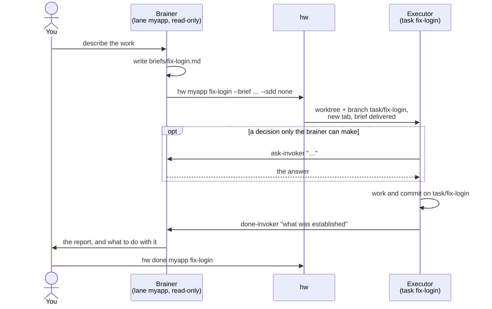

# foreman-sh

**Plan with one agent. Build with many. Keep your repository out of the
planner's hands.**

[](https://github.com/GenaroSalomone/foreman-sh/actions/workflows/ci.yml)
[](LICENSE)

foreman-sh is a small shell harness, built on herdr, that runs coding agents over your own
repositories in two roles: a long-lived **brainer** that thinks and writes
briefs but cannot touch your code, and disposable **executors** that each take
one brief, work in a git worktree of their own, and report back when they are
done. The commands are `hw` and `brain`.

> **Release candidate.** Interfaces may still change. What is new is in
> [`RELEASE-NOTES.md`](RELEASE-NOTES.md) and [`CHANGELOG.md`](CHANGELOG.md);
> known limitations are in [`KNOWN-LIMITATIONS.md`](KNOWN-LIMITATIONS.md).
> Not related to Ruby's `foreman`.

## Quickstart

With [herdr](https://herdr.dev) and [Claude Code](https://claude.com/claude-code)
installed (see [Requirements](#requirements)):

```sh
git clone https://github.com/GenaroSalomone/foreman-sh && cd foreman-sh
./install.sh --brain ~/brain --check                             # looks at everything, writes nothing
./install.sh --brain ~/brain --lane myapp --repo ~/code/myapp    # a brain and its first lane
brain myapp                                                      # opens the lane's brainer in herdr
```

`--check` lists every fix at once, in the order it must be done, and ends with
one `Next step:`. Run it again after each fix until it says nothing is left.
Then describe the work to the brainer. [Your first task](#your-first-task)
walks a throwaway lane end to end.

## Features

- **A planner that cannot write.** A guard refuses the brainer's writes into
  your repositories: the line between deciding and doing is enforced.
- **One worktree and branch per task.** Executors never share a checkout.
- **Reports that arrive.** `done-invoker` delivers each report into the
  brainer's session; nothing is polled.
- **Briefs with a contract.** Front-matter that `hw` checks before building
  anything, and a verification command it re-runs when the task closes.
- **Several agents at once.** Claude Code by default, OpenCode for a lane's
  executors, Codex as a reduced dispatch target.
- **Decisions on record.** `decisions.md` keeps what was ruled out, so a
  rejected idea is found before it is proposed again.

## Contents

- [Why it exists](#why-it-exists)
- [How it works](#how-it-works)
- [How it compares](#how-it-compares)
- [Requirements](#requirements)
- [Install](#install)
- [Optional pieces](#optional-pieces)
- [Your first task](#your-first-task)
- [Concepts](#concepts)
- [Everyday commands](#everyday-commands)
- [Configuration](#configuration)
- [Repository layout](#repository-layout)
- [Tests](#tests)
- [Feedback and contributing](#feedback-and-contributing)
- [License](#license)

## Why it exists

Put one coding agent on a repository and it plans and edits in the same
breath. Put several on it and three things go wrong:

- **The planner starts editing.** A session meant to decide what to build
  "just fixes one thing", and now nobody reviewed the plan or the change.
- **Agents trample each other.** Two sessions in one checkout share a branch,
  an index and uncommitted files, and neither can tell what the other did.
- **Results disappear.** The outcome of a long task sits in a terminal pane
  nobody is watching, and you find out by polling.

foreman-sh answers each with a mechanism rather than a convention: a guard
that refuses the planner's writes, one worktree and branch per task, and a
return channel that delivers every report into the planner's session. It is
for a developer who already works with coding agents in a terminal and wants
to run several at once over repositories they care about.

## How it works

A **lane** is one of your repositories plus the brainer that plans for it.
Everything below happens inside [herdr](https://herdr.dev), the terminal
multiplexer that hosts every agent as a pane.



A task, end to end:

1. **Brief.** You tell the brainer what you want. It reads the code, decides
   the shape of the work and writes a brief: a Markdown file with the goal,
   what is in and out of scope, and the commands that prove it is done.
2. **Dispatch.** The brainer runs `hw` from its own pane. `hw` creates a git
   worktree outside your checkout, on a branch of its own, opens a new herdr
   tab, starts the agent there and hands it the brief. It then checks that
   the brief actually entered the conversation.
3. **Work.** The executor works and commits on its branch. The brainer is free
   to plan the next task, or to launch a second executor next to the first.
4. **Report.** The executor ends by running `done-invoker` with a short
   summary. The report lands in the brainer's session as a new message; nobody
   polls anything. If it stops early, `done-invoker --blocked` says why.
5. **Close.** You or the brainer read the result, then `hw done` closes the
   executor's tab. Merging the branch stays yours: the harness never merges,
   and deletes a task branch only once git agrees it is merged (`hw reap
   --apply`).

## How it compares

Checked on 2026-09-30 against each project's own page. The footnote on a
project's name is the source for every cell in its row; where that page does
not say, the cell reads "not verified" (which is not the same as "absent").
foreman's row is this README.

| | Isolation | Planner guard | Brief with contract | Re-run verification | Memory | Multi-vendor | UI | Install |
|---|---|---|---|---|---|---|---|---|
| **foreman** | worktree + branch per task | yes: mistaken repo writes refused | yes: front-matter checked by `hw` | yes: pinned command re-run at close | `decisions.md`; engram optional | Claude Code, OpenCode; Codex reduced | herdr panes (terminal) | clone + `install.sh` |
| claude-squad[^cs] | tmux session + worktree per agent | not verified | not verified | not verified | not verified | Claude Code, Codex, Gemini, Aider, other local agents | TUI | `brew install claude-squad` or curl script |
| Conductor[^co] | "isolated workspaces" (mechanism not verified) | not verified | not verified | not verified | not verified | Claude Code, Codex, Cursor | Mac app | download |
| uzi[^uz] | worktree per agent | not verified | task given as a prompt (`uzi prompt`); no contract shown | not verified | not verified | claude, codex, "your AI tool of choice" | CLI + tmux | `go install` |
| container-use[^cu] | container + git branch per agent | not verified | not verified | not verified (shows command history and logs) | not verified | any agent via MCP | terminal + web URLs | `brew install dagger/tap/container-use` or curl script |
| vibe-kanban[^vk] | workspace with a branch per task (mechanism not verified) | not verified | kanban issue as the task; no contract shown | not verified | not verified | 10 agents listed, incl. Claude Code, Codex, Gemini CLI | web kanban | `npx vibe-kanban` |
| Superset[^ss] | not verified | not verified (diff viewer before commit) | task described when creating a workspace | not verified | sessions persist across restarts | 20+ agents | desktop app (Electron) | download; macOS, Linux experimental |
| Claude Code agent teams[^at] | docs warn: "two teammates editing the same file leads to overwrites" | teammate is read-only until its plan is ready; the plan is auto-approved by the lead | spawn prompt; lead's history not carried over | hooks (`TaskCompleted`) can block completion; you write the check | task list persists; in-process teammates not restored on resume | Claude Code only | in-process panel, or tmux / iTerm2 panes | env var (experimental) |

Also relevant: claude-squad is AGPL-3.0, Superset Elastic-2.0, uzi MIT,
container-use Apache-2.0 (marked early development), and vibe-kanban
announces it is sunsetting[^vk]. foreman is MIT.

### When not to use foreman

- You run one agent on one task: a plain Claude Code session or a worktree
  is enough, and foreman adds a brainer, a brief and a report for nothing.
- You want a GUI or a kanban board: foreman lives in terminal panes.
- You want one-line install today: foreman needs herdr and an `install.sh`
  with flags.
- You need container-level isolation or a Windows-native setup with no WSL2
  or Git Bash: foreman isolates with git worktrees only.

[^cs]: <https://github.com/smtg-ai/claude-squad>, README, fetched 2026-09-30.
[^co]: <https://www.conductor.build>, home page, fetched 2026-09-30.
[^uz]: <https://github.com/devflowinc/uzi>, README, fetched 2026-09-30.
[^cu]: <https://github.com/dagger/container-use>, README, fetched 2026-09-30.
[^vk]: <https://github.com/BloopAI/vibe-kanban>, README, fetched 2026-09-30.
[^ss]: <https://github.com/superset-sh/superset>, README, fetched 2026-09-30.
[^at]: <https://code.claude.com/docs/en/agent-teams>, fetched 2026-09-30.

## Requirements

| Platform | How |
|---|---|
| macOS | Native. |
| Linux | Native. |
| Windows | Through WSL2 (recommended), or natively under Git Bash. Git Bash needs Developer Mode, a native Windows `python3` first on `PATH`, and `core.autocrlf false`; see `INSTALL.md`, Windows. |

Per-platform details are in [`INSTALL.md`](INSTALL.md).

You also need:

- **[herdr](https://herdr.dev)**, running, with its Claude Code integration
  (`herdr integration install claude`). Required: every brainer and executor
  is a herdr pane.
- **[Claude Code](https://claude.com/claude-code)** with its first run
  finished (see [Install](#install)). It is the default agent and always the
  brainer.
- `git`, `jq` 1.7 or newer, `python3`. On Linux also `sd`, `fd`, `rg` and
  Node 22.7 or newer, which `install.sh --check` requires there. On Git Bash, Windows builds of `jq`, `rg`, `fd` and
  `sd`, which Git for Windows does not ship.
- Optional: **engram** (recommended) for memory across sessions, and **Judgment Day** for
  review (see [Optional pieces](#optional-pieces), which says exactly when each
  becomes mandatory); `fzf` for `hw`'s pickers.

Agents other than Claude Code:

- **[OpenCode](https://opencode.ai)** 1.18.31 or newer can run a lane's
  executors (`--vendor opencode` at install), with herdr's OpenCode
  integration (`herdr integration install opencode`).
- **Codex** can be dispatched as an executor with `--sdd none` only, and is
  not set up by the installer, guard registration included
  (see [`KNOWN-LIMITATIONS.md`](KNOWN-LIMITATIONS.md), L3 and L5).

## Install

```sh
git clone https://github.com/GenaroSalomone/foreman-sh && cd foreman-sh
./install.sh --brain ~/brain --check                            # look, write nothing
./install.sh --brain ~/brain --lane myapp --repo ~/code/myapp   # a brain and its first lane
./install.sh --brain ~/brain --lane other --repo ~/code/other   # every further lane
```

`--check` evaluates everything in one pass and writes nothing: it names what is
missing with the command that fixes it, lists the fixes in dependency order
(Claude Code's first run, herdr's integration, engram, a lane) and ends with a
single `Next step:`. The real run:

- builds the brain directory (`~/brain`) with one folder per lane;
- links `hw`, `brain`, `done-invoker`, `ask-invoker`, `channel-send` and
  `decisions` into `~/.local/bin`;
- merges one Stop hook into your Claude Code settings, keeping a backup of the
  previous file.

It never writes inside your repository and never reads a credential. If
something already there differs from what it would write, it stops and names
it before writing anything. Running the same command twice changes nothing.

**Two steps are yours, once per machine.** Claude Code's welcome, login and
Bypass Permissions warning cannot be answered by a script, and every agent
here runs in that mode:

```sh
claude --dangerously-skip-permissions   # finish the welcome and login, accept the warning, /exit
herdr integration install claude        # needs Claude Code's first run to have happened
```

The installer checks both and prints these commands when one is missing.
[`INSTALL.md`](INSTALL.md) has the full reference: every option, what each
file it writes is for, OpenCode lanes, engram and Windows.

## Optional pieces

Two pieces make the harness more dependable. Neither is needed to run it; each
becomes a requirement only under the condition stated below.

**engram, persistent memory across sessions.** [engram](https://github.com/Gentleman-Programming/engram)
is an MIT-licensed memory server for coding agents (a Go binary with SQLite and
an MCP server). With it, a brainer recovers earlier decisions and findings
instead of starting cold. Without it the harness runs and each report still
reaches the brainer's session, but nothing is saved: later sessions start
cold. The installer's `--check` lists it as a recommended step, never a blocker.

**When it becomes mandatory:** only for a task whose executor `hw` registered an
engram session for at dispatch (the receipt's `engram_session` is an `hw-…` id,
which needs a reachable engram server that is this machine's own store). For
that task `done-invoker` refuses a completion report that names no stored
observation as `#<id>` under the lane's project. A run with no registered
session is not held to it, and `--blocked` is never held to it.

```sh
brew install gentleman-programming/tap/engram
engram setup claude-code
```

Other platforms are covered in engram's
[installation guide](https://github.com/Gentleman-Programming/engram/blob/main/docs/INSTALLATION.md).

**Judgment Day, review before "done".** Optional: nothing refuses a task for
lacking it, except a brief that declares `boundary:` in its front-matter (a
build, or a brief with no `kind:`, whose approach is where it can go wrong). Such a task is not accepted as
done without `design-judgment.md` in its artifacts, naming that boundary and
ending in `JUDGMENT: APPROVED`, which is what Judgment Day's design mode
writes; without the skill installed you cannot produce it honestly, so do not
put `boundary:` in a brief until you activate it. Two judges read the same diff blind,
and only a severe defect both confirm is fixed, in at most two rounds. It ships
in `_skills/judgment-day/` with its three agents in `_agents/`, derived from
[Gentle AI](https://github.com/Gentleman-Programming/gentle-ai): the skill under
the Apache License 2.0, the agents under the MIT License. Activation is one
command, which never overwrites a file of yours (details in
[`INSTALL.md`](INSTALL.md), Judgment Day):

```sh
./install.sh --brain ~/brain --with-judgment-day
```

## Your first task

[`examples/demo/`](examples/demo/README.md) is a lane made to be thrown away.
It installs against a repository of one file, so the example brief has
something to read, and dispatches a one-line brief:

```sh
git init ~/code/toy && echo "toy: a throwaway repository for trying foreman-sh." > ~/code/toy/README.md
git -C ~/code/toy add README.md && git -C ~/code/toy commit -m init
./install.sh --brain ~/brain --lane demo --repo ~/code/toy
cp examples/demo/briefs/hello.md ~/brain/demo/briefs/
brain demo                                   # opens the demo brainer in herdr
```

From inside the brainer's pane (ask the brainer to run it, or type it with
Claude Code's `!` prefix):

```sh
hw demo hello --brief ~/brain/demo/briefs/hello.md --sdd none --dry-run
hw demo hello --brief ~/brain/demo/briefs/hello.md --sdd none
```

The dry run prints the whole dispatch — worktree, branch, base, placement,
agent, account — marks each field *chosen* or *defaulted*, and creates
nothing. The second command opens the executor in a new tab; a few moments
later its report arrives in the brainer.

`hw` has to know which pane to report to, and it learns that from the pane it
runs in. From a plain terminal a dry run stops at `HW_INVOKER_PANE is
UNRESOLVED`; add `--no-report` there to see the manifest anyway
(see [`KNOWN-LIMITATIONS.md`](KNOWN-LIMITATIONS.md)).

## Concepts

**Brain.** The directory the installer builds (`~/brain` above). It holds
the mechanism, the configuration and one folder per lane. It is yours and
lives outside every repository it serves.

**Lane.** One repository, its base branch, its default agent and the rules
for building a task's worktree. A lane's folder holds its `CLAUDE.md`, its
`briefs/` and its `decisions.md`.

**Brainer.** A long-lived Claude Code session opened by `brain <lane>`,
rooted in the lane's folder. It reads anything, plans, writes briefs and
dispatches. A guard refuses its writes into the lane's repository, so the
line between deciding and doing is enforced, not requested.

**Executor.** A disposable session started by `hw` for one task: its own
worktree under `~/work/<lane>/<task>`, beside the brain, its own branch (`task/<task>`
by default), its own herdr tab. It may write, commit and run anything its
brief asks for, and it ends with exactly one report.

**Brief.** The executor's contract, in Markdown. [`BRIEF-TEMPLATE.md`](BRIEF-TEMPLATE.md)
shows the sections. Two parts do more than inform: an optional front-matter
block (`agent:`, `kind:`, `base:`, `requires:` …) that `hw` checks against
the dispatch before building anything, refusing on a mismatch; and a fenced
verification command that `hw` pins at dispatch and runs again itself when
the task is closed, so `hw receipt` shows what was measured next to what was
asked.

**Return channel.** `done-invoker` reports, `ask-invoker` asks the brainer
one question and waits for the answer, and `channel-send` is the transport
beneath both. Every message is addressed to a pane and confirmed on arrival,
so a failed delivery says so instead of vanishing.

**Guards.** Hooks for Claude Code, a plugin for OpenCode and a hook script for
Codex (which you register in Codex's own configuration; the installer does
not) that refuse a brainer's writes into protected repositories, plus a reverse
guard that refuses a product executor's writes into the brain. They resolve
where a write really lands — through `~`, environment variables, `..` and
symlinks — before deciding. They catch a mistaken write; they are not a
sandbox. On macOS, `hw <lane> <task> --sandbox` is one: the executor runs in a
Seatbelt profile that confines its writes and cuts its control sockets, and
reports through an outbox. What each stops and what it does not is in
[`THREAT-MODEL.md`](THREAT-MODEL.md).

**Decisions.** `decisions.md` is a lane's append-only record of what was
decided, what it rules out and what would reverse it, so a rejected idea is
found before it is proposed again. The `decisions` command indexes it
together with its archives and rotates old entries out when it grows.

## Everyday commands

| Command | What it does |
|---|---|
| `brain <lane>` | Open, or return to, the lane's brainer. |
| `hw <lane> <task> --brief <path> --sdd none` | Dispatch an executor. Add `--dry-run` first. |
| `hw status` | What is running, what reported, what was left behind. |
| `hw reports [<lane>]` | Which reports are on disk; with a task, its text. |
| `hw receipt <lane> <task>` | What was measured, next to what was dispatched. |
| `hw log <lane> <task>` | What a task asked, was ruled and reported, from disk. |
| `hw outbox [flush --to <pane>]` | Reports that never reached a brainer; `flush` redelivers them. |
| `hw ruling <pane> "<correction>"` | Queue a correction for an executor that is still working. |
| `hw next <pane> --brief <path>` | Hand a finished executor its next task, keeping its session. |
| `hw done <lane> <task>` | Close a task's executor. Refuses one that has not reported. |
| `hw reap [<lane>]` | List worktrees that are provably safe to remove; `--apply` removes them and their merged branches. |

`hw --help` is one page; `hw help <topic>` lists every command, flag and exit status. `--sdd none` is the
declaration that a task runs outside any spec-driven framework; `--sdd
speckit` enters Spec Kit's flow where its skills are installed.

## Configuration

The mechanism in `bin/` is the same for every lane; what differs is data.

- **`projects.json`** — the lanes: repository, base branch, branch pattern,
  worktree location, default agent and model, and the script that builds a
  task's worktree (`lanes/git-worktree.sh` unless a lane names its own). The
  installer adds a row per `--lane`; edit it for anything the installer does
  not ask.
- **`guards.json`** — what the guards protect. Every lane protects every
  entry in `product_repos` plus its own repository and worktrees. A missing
  or malformed file makes every guard refuse; it never lets a write through.
- **Install options** — `--vendor opencode` and `--model` choose a lane's
  executor agent; `--operator`, `--min-model` and `--requested-by` set how
  `hw` addresses you, the lowest model tier a lane accepts, and whether every
  brief must cite the request it answers. A new lane asks for these in a
  terminal and keeps the defaults in a script. See `INSTALL.md`.

## Repository layout

| Path | What it is |
|---|---|
| `install.sh`, `INSTALL.md` | the installer and its reference |
| `bin/` | the mechanism: `hw`, `brain`, the invokers, the channel, the hooks |
| `lanes/git-worktree.sh` | how a lane's task worktree is built |
| `layouts/` | herdr pane layouts |
| `projects.json`, `guards.json` | example configuration; the installer writes your own |
| `BRIEF-TEMPLATE.md` | the sections a brief can carry |
| `setup/guards/` | the guards for Claude Code, OpenCode and Codex, with their vector and mutation tests |
| `setup/hooks/` | git hooks for developing the harness itself |
| `setup/test-hw`, `setup/tests/` | the test suite |
| `examples/demo/` | a lane to try the install on |

## Tests

```sh
HW_TEST_GATE=fast bash setup/test-hw   # the fast gate
bash setup/test-hw                     # the full suite
bash setup/test-channel-send           # the return channel's transport
```

The suite is hermetic: every subject runs under a home directory of its own,
with herdr stubbed and every dispatch a dry run. It touches nothing of yours.

## Feedback and contributing

Bug reports, guard vectors and pull requests are welcome: see
[`CONTRIBUTING.md`](CONTRIBUTING.md). A vulnerability goes through
[`SECURITY.md`](SECURITY.md), not a public issue.

## License

MIT. See [`LICENSE`](LICENSE).
