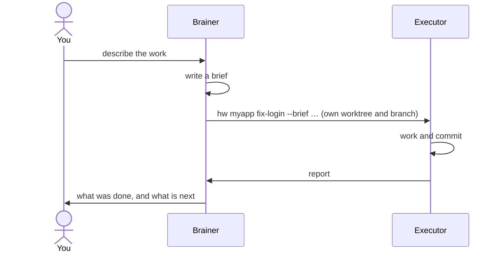

# foreman-sh

**Plan with one agent. Build with many. Keep your repository out of the planner's hands.**

[](https://github.com/GenaroSalomone/foreman-sh/actions/workflows/ci.yml)
[](LICENSE)

foreman-sh is a shell harness, built on [herdr](https://herdr.dev), that runs
coding agents in two roles:

- a **brainer**, the planner, that reads your code, plans the work and writes
  briefs, but cannot touch your repository;
- **executors** that each take one brief, work in a git worktree of their own
  and report back when they are done.

You talk to the brainer. It sends out the work, and the results come back to
it.



Not related to Ruby's `foreman`.

## Why

Put several coding agents on one repository and three things go wrong:

- **The planner starts editing**, and changes land that nobody reviewed.
- **Agents step on each other** in a shared checkout.
- **Results get lost** in a pane nobody is watching.

foreman-sh answers each one with a mechanism:

- a guard that refuses the brainer's writes;
- one worktree and one branch per task;
- a report that lands in the brainer's session by itself.

## Concepts

| Term | Meaning |
|---|---|
| **Brain** | The directory the installer creates (`~/brain` in these examples). It holds foreman-sh's commands, its configuration and one folder per lane, outside every repository. |
| **Lane** | One of your repositories, together with the brainer that plans for it. |
| **Brainer** | A long-lived Claude Code session for a lane, opened with `brain <lane>`. It plans and writes briefs; a guard refuses its writes to the repository. |
| **Executor** | A disposable agent session, launched with `hw`. It works in its own worktree and branch and ends each task with a report. |
| **Brief** | The executor's instructions, as a Markdown file: goal, scope and the command that proves the work is done. |

## Requirements

- **macOS or Linux** (Debian/Ubuntu-class, bash 5). On Windows, use WSL2;
  native Git Bash is covered by CI only ([details](INSTALL.md#windows)).
- **[herdr](https://herdr.dev)**, running, with its Claude Code integration:
  `herdr integration install claude`.
- **[Claude Code](https://claude.com/claude-code)**, with its first run
  finished: run `claude --dangerously-skip-permissions`, complete the welcome
  and login, accept the warning, then `/exit`. Skipping permission prompts is
  the recommended setting, not a requirement: `install.sh --permissions ask`
  leaves them on ([INSTALL.md](INSTALL.md#permissions-skip-recommended-or-ask)).
- `git`, `jq` 1.7 or newer, `python3`, `rg`, `fd` and `sd`. On Linux, also
  Node 22.7 or newer.

On macOS, Homebrew installs all of these but Claude Code's first run (see the
Quickstart).

[engram](https://github.com/Gentleman-Programming/engram) is recommended, and
two more tools are optional:

- **engram** gives the brainer memory across sessions; without it,
  nothing is saved between them. Install it with
  `brew install gentleman-programming/tap/engram && engram setup claude-code`,
  and answer `y` when it asks about the allowlist. Required for a task that
  `hw` registered an engram session for.
- **Judgment Day** is a blind review of a diff by two judges. Required only by
  a brief that declares `boundary:`. Install it with
  `./install.sh --brain ~/brain --with-judgment-day`.
- **[OpenCode](https://opencode.ai)** 1.18.31 or newer, with
  `herdr integration install opencode`, can run a lane's executors:
  `./install.sh … --vendor opencode`.

## Quickstart

On macOS, with [Homebrew](https://brew.sh):

```sh
brew install GenaroSalomone/tap/foreman-sh                    # foreman-sh, with herdr, jq, rg, fd and sd
foreman-sh --with-recommended                                 # what is still missing: Claude Code, engram, fzf
foreman-sh --brain ~/brain --lane myapp --repo ~/code/myapp   # creates your brain and a first lane
export PATH="$HOME/.local/bin:$PATH"                          # puts hw and brain on your PATH
brain myapp                                                   # opens the brainer
```

`foreman-sh` is `install.sh`, packaged: it takes the same flags. Only the
first and third lines are required. `--with-recommended` installs each missing
package with its own `brew install` (Claude Code as the `claude-code` cask)
and prints the command before running it. Nothing is installed unless you ask
for it this way. `foreman-sh --with-recommended --check` prints the commands
without running them. Before your first `brain`, finish Claude Code's first run
and wire herdr and engram into it: `foreman-sh --brain ~/brain --check` names
each step, in order.

On Linux, or without Homebrew, the installer runs from a pipe:

```sh
curl -fsSL https://raw.githubusercontent.com/GenaroSalomone/foreman-sh/main/install.sh | bash -s -- --brain ~/brain --check   # checks everything, writes nothing
curl -fsSL https://raw.githubusercontent.com/GenaroSalomone/foreman-sh/main/install.sh | bash -s -- --brain ~/brain --lane myapp --repo ~/code/myapp   # creates your brain and a first lane
export PATH="$HOME/.local/bin:$PATH"                            # puts hw and brain on your PATH
brain myapp                                                     # opens the brainer
```

Piped like this, `install.sh` clones the latest published release tag (not
`main`) into a temporary directory, runs it with your arguments and removes it.
It needs `git` and `curl`, and says so when one is missing.

Prefer to read the installer first? Clone the repository and run it from there:

```sh
git clone https://github.com/GenaroSalomone/foreman-sh && cd foreman-sh
./install.sh --brain ~/brain --check
./install.sh --brain ~/brain --lane myapp --repo ~/code/myapp
```

`--check` lists everything that is missing, in order, and ends with the next
command to run. Run it again until nothing is left. Add the `PATH` line to your
shell profile so it survives a new terminal.

The installer never writes inside your repositories and never reads a
credential.

## Try it on a toy repository

```sh
git init ~/code/toy && echo "toy: a throwaway repository for trying foreman-sh." > ~/code/toy/README.md
git -C ~/code/toy add README.md && git -C ~/code/toy commit -m init
./install.sh --brain ~/brain --lane demo --repo ~/code/toy
cp examples/demo/briefs/hello.md ~/brain/demo/briefs/
brain demo
```

Then, in the brainer (type it with Claude Code's `!` prefix, or ask the brainer
to do it):

```sh
hw demo hello --brief ~/brain/demo/briefs/hello.md --sdd none --dry-run   # shows the plan, creates nothing
hw demo hello --brief ~/brain/demo/briefs/hello.md --sdd none             # launches it
```

An executor opens in a new herdr tab, writes `HELLO.md`, commits it on branch
`task/hello`, and its report arrives in the brainer's session.

## How it works

1. **Brief.** You describe the work; the brainer writes a brief.
2. **Dispatch.** `hw` creates a worktree and branch outside your checkout,
   opens a herdr tab, starts the agent and makes sure the brief arrived.
3. **Work.** The executor works and commits on its branch. If it needs a
   decision, it asks the brainer with `ask-invoker` and waits for the answer.
4. **Report.** The executor finishes with `done-invoker`. The report arrives
   in the brainer as a message, with no polling.
5. **Close.** `hw done` runs the brief's verification, records the result and
   closes the tab. Merging is always up to you.

## Commands

| Command | What it does |
|---|---|
| `brain <lane>` | Open the lane's brainer. |
| `hw <lane> <task> --brief <path> --sdd none` | Launch an executor. Add `--dry-run` to preview. |
| `hw status` | What is running, what reported and what is left over. |
| `hw log <lane> <task>` | What a task asked and reported. |
| `hw ruling <pane> "<correction>"` | Correct an executor that is still working. |
| `hw next <pane> --brief <path>` | Give the next task to an executor launched with `--keep-pane`. |
| `hw done <lane> <task>` | Run the brief's verification and close the task's tab. Removes no worktree or branch. |
| `hw reap [<lane>]` | List worktrees that are safe to remove. Add `--apply` to remove them. |

`<pane>` is the executor's herdr pane, as `hw status` lists it. `hw help all`
lists every command and flag; `hw help <topic>` shows one part.

`--sdd speckit` runs a task through [Spec Kit](https://github.com/github/spec-kit)
when its skills are in the repository. To use another methodology your
repository already has, name it in the brief.

## How it compares

| | Isolation | Guards the brainer | Agents | UI |
|---|---|---|---|---|
| **foreman-sh** | worktree and branch per task | yes | Claude Code, OpenCode, Codex (limited) | herdr panes |
| [claude-squad](https://github.com/smtg-ai/claude-squad) | tmux and worktree per agent | — | Claude Code, Codex, Gemini, Aider | TUI |
| [Conductor](https://www.conductor.build) | isolated workspaces | — | Claude Code, Codex, Cursor | macOS app |
| [uzi](https://github.com/devflowinc/uzi) | worktree per agent | — | Claude Code, Codex and others | CLI and tmux |
| [container-use](https://github.com/dagger/container-use) | container per agent | — | any agent through MCP | terminal and web |
| [vibe-kanban](https://github.com/BloopAI/vibe-kanban) | branch per task | — | Claude Code, Codex, Gemini and others | web kanban |
| [Claude Code agent teams](https://code.claude.com/docs/en/agent-teams) | shared checkout | plan approval | Claude Code | panel or tmux |

Compared from each project's own documentation, September 2026.

What foreman-sh adds on top of isolation:

- the brainer cannot write to your code;
- a brief's front matter is checked against the dispatch before anything is
  built;
- `hw done` runs the brief's verification command itself and records its exit
  code in the receipt.

## Learn more

- [`INSTALL.md`](INSTALL.md): every install option, OpenCode, engram and Windows.
- [`BRIEF-TEMPLATE.md`](BRIEF-TEMPLATE.md): what a brief can contain.
- [`THREAT-MODEL.md`](THREAT-MODEL.md): what the guards stop, what they do not
  stop and the opt-in macOS `--sandbox`.
- [`KNOWN-LIMITATIONS.md`](KNOWN-LIMITATIONS.md): what this release does not
  do, or does only partly.
- [`CHANGELOG.md`](CHANGELOG.md): what changed in each release.
- [`CONTRIBUTING.md`](CONTRIBUTING.md) and [`SECURITY.md`](SECURITY.md).

## License

MIT. See [`LICENSE`](LICENSE).
