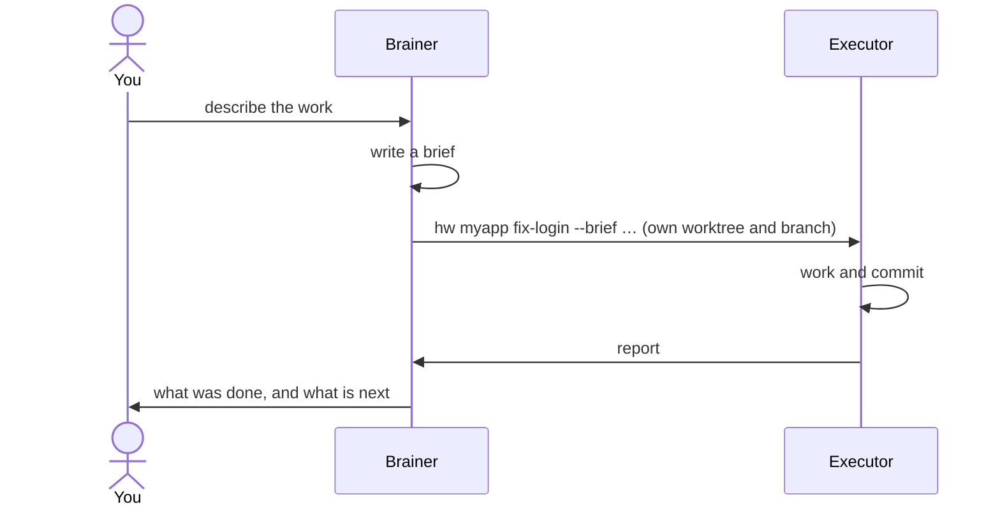

# foreman-sh

**Plan with one agent. Build with many. Keep your repository out of the planner's hands.**

[](https://github.com/GenaroSalomone/foreman-sh/actions/workflows/ci.yml)
[](LICENSE)

foreman-sh is a shell harness, built on [herdr](https://herdr.dev), that runs
coding agents in two roles:

- a **brainer**, the planner, that reads your code, plans the work and writes
  briefs, but cannot touch your repository;
- **executors** that each take one brief, work in a git worktree of their own
  and report back when they are done.

You talk to the brainer. It sends out the work, and the results come back to
it.



Not related to Ruby's `foreman`.

## Why

Put several coding agents on one repository and three things go wrong:

- **The planner starts editing**, and changes land that nobody reviewed.
- **Agents step on each other** in a shared checkout.
- **Results get lost** in a pane nobody is watching.

foreman-sh answers each one with a mechanism:

- a guard that refuses the brainer's writes;
- one worktree and one branch per task;
- a report that lands in the brainer's session by itself.

## Concepts

| Term | Meaning |
|---|---|
| **Brain** | The directory the installer creates (`~/brain` in these examples). It holds foreman-sh's commands, its configuration and one folder per lane, outside every repository. |
| **Lane** | One of your repositories, together with the brainer that plans for it. |
| **Brainer** | A long-lived Claude Code session for a lane, opened with `brain <lane>`. It plans and writes briefs; a guard refuses its writes to the repository. |
| **Executor** | A disposable agent session, launched with `hw`. It works in its own worktree and branch and ends each task with a report. |
| **Brief** | The executor's instructions, as a Markdown file: goal, scope and the command that proves the work is done. |

## Requirements

- **macOS or Linux** (Debian/Ubuntu-class, bash 5). On Windows, use WSL2;
  native Git Bash is covered by CI only ([details](INSTALL.md#windows)).
- **[herdr](https://herdr.dev)**, running, with its Claude Code integration:
  `herdr integration install claude`.
- **[Claude Code](https://claude.com/claude-code)**, with its first run
  finished: run `claude --dangerously-skip-permissions`, complete the welcome
  and login, accept the warning, then `/exit`. Skipping permission prompts is
  the recommended setting, not a requirement: `install.sh --permissions ask`
  leaves them on ([INSTALL.md](INSTALL.md#permissions-skip-recommended-or-ask)).
- `git`, `jq` 1.7 or newer, `python3`, `rg`, `fd` and `sd`. On Linux, also
  Node 22.7 or newer.

On macOS, Homebrew installs all of these but Claude Code's first run (see the
Quickstart).

[engram](https://github.com/Gentleman-Programming/engram) is recommended, and
two more tools are optional:

- **engram** gives the brainer memory across sessions; without it,
  nothing is saved between them. Install it with
  `brew install gentleman-programming/tap/engram && engram setup claude-code`,
  and answer `y` when it asks about the allowlist. Required for a task that
  `hw` registered an engram session for.
- **Judgment Day** is a blind review of a diff by two judges. Required only by
  a brief that declares `boundary:`. Install it with
  `./install.sh --brain ~/brain --with-judgment-day`.
- **[OpenCode](https://opencode.ai)** 1.18.31 or newer, with
  `herdr integration install opencode`, can run a lane's executors:
  `./install.sh … --vendor opencode`.

## Quickstart

On macOS, with [Homebrew](https://brew.sh):

```sh
brew install GenaroSalomone/tap/foreman-sh                    # foreman-sh, with herdr, jq, rg, fd and sd
foreman-sh --with-recommended                                 # what is still missing: Claude Code, engram, fzf
foreman-sh --brain ~/brain --lane myapp --repo ~/code/myapp   # creates your brain and a first lane
export PATH="$HOME/.local/bin:$PATH"                          # puts hw and brain on your PATH
brain myapp                                                   # opens the brainer
```

`foreman-sh` is `install.sh`, packaged: it takes the same flags. Only the
first and third lines are required. `--with-recommended` installs each missing
package with its own `brew install` (Claude Code as the `claude-code` cask)
and prints the command before running it. Nothing is installed unless you ask
for it this way. `foreman-sh --with-recommended --check` prints the commands
without running them. Before your first `brain`, finish Claude Code's first run
and wire herdr and engram into it: `foreman-sh --brain ~/brain --check` names
each step, in order.

On Linux, or without Homebrew, the installer runs from a pipe:

```sh
curl -fsSL https://raw.githubusercontent.com/GenaroSalomone/foreman-sh/main/install.sh | bash -s -- --brain ~/brain --check   # checks everything, writes nothing
curl -fsSL https://raw.githubusercontent.com/GenaroSalomone/foreman-sh/main/install.sh | bash -s -- --brain ~/brain --lane myapp --repo ~/code/myapp   # creates your brain and a first lane
export PATH="$HOME/.local/bin:$PATH"                            # puts hw and brain on your PATH
brain myapp                                                     # opens the brainer
```

Piped like this, `install.sh` clones the latest published release tag (not
`main`) into a temporary directory, runs it with your arguments and removes it.
It needs `git` and `curl`, and says so when one is missing.

Prefer to read the installer first? Clone the repository and run it from there:

```sh
git clone https://github.com/GenaroSalomone/foreman-sh && cd foreman-sh
./install.sh --brain ~/brain --check
./install.sh --brain ~/brain --lane myapp --repo ~/code/myapp
```

`--check` lists everything that is missing, in order, and ends with the next
command to run. Run it again until nothing is left. Add the `PATH` line to your
shell profile so it survives a new terminal.

The installer never writes inside your repositories and never reads a
credential.

## Try it on a toy repository

```sh
git init ~/code/toy && echo "toy: a throwaway repository for trying foreman-sh." > ~/code/toy/README.md
git -C ~/code/toy add README.md && git -C ~/code/toy commit -m init
./install.sh --brain ~/brain --lane demo --repo ~/code/toy
cp examples/demo/briefs/hello.md ~/brain/demo/briefs/
brain demo
```

Then, in the brainer (type it with Claude Code's `!` prefix, or ask the brainer
to do it):

```sh
hw demo hello --brief ~/brain/demo/briefs/hello.md --sdd none --dry-run   # shows the plan, creates nothing
hw demo hello --brief ~/brain/demo/briefs/hello.md --sdd none             # launches it
```

An executor opens in a new herdr tab, writes `HELLO.md`, commits it on branch
`task/hello`, and its report arrives in the brainer's session.

## How it works

1. **Brief.** You describe the work; the brainer writes a brief.
2. **Dispatch.** `hw` creates a worktree and branch outside your checkout,
   opens a herdr tab, starts the agent and makes sure the brief arrived.
3. **Work.** The executor works and commits on its branch. If it needs a
   decision, it asks the brainer with `ask-invoker` and waits for the answer.
4. **Report.** The executor finishes with `done-invoker`. The report arrives
   in the brainer as a message, with no polling.
5. **Close.** `hw done` runs the brief's verification, records the result and
   closes the tab. Merging is always up to you; once a task is merged, its
   worktree, branch and database are removed by `hw reap`, which the brainer's
   session start runs in the background, after archiving the task's outputs.

## Commands

| Command | What it does |
|---|---|
| `brain <lane>` | Open the lane's brainer. |
| `hw <lane> <task> --brief <path> --sdd none` | Launch an executor. Add `--dry-run` to preview. |
| `hw status` | What is running, what reported and what is left over. |
| `hw log <lane> <task>` | What a task asked and reported. |
| `hw ruling <pane> "<correction>"` | Correct an executor that is still working. |
| `hw next <pane> --brief <path>` | Give the next task to an executor launched with `--keep-pane`. |
| `hw done <lane> <task>` | Run the brief's verification and close the task's tab. Waits up to 60 s for the report's own turn to end. A merged, clean task is then reaped like `hw reap --apply`. |
| `hw reap [<lane>]` | List merged worktrees and task branches that are safe to remove. `--apply` removes them, archiving `.artifacts`/`qa-report` to `archive/<lane>/<task>/` beside the work directory first. Dirty, unmerged or occupied work is never removed. |
| `hw train add <lane> <task>` | Merge a reported task's branch into `train-<lane>`. Only a `setup/test-budgets.json` conflict is resolved; any other is named. |
| `hw train push <lane>` | Run the full suite on the train, then move `main` to it, keeping uncommitted edits in the checkout. Pushes nothing. |

`<pane>` is the executor's herdr pane, as `hw status` lists it. `hw help all`
lists every command and flag; `hw help <topic>` shows one part.

`--sdd speckit` runs a task through [Spec Kit](https://github.com/github/spec-kit)
when its skills are in the repository. To use another methodology your
repository already has, name it in the brief.

## Customizing a lane (`projects.json`)

`projects.json` at the brain root is the one place a lane's settings live.
`hw`, `brain` and the invokers read it once per process, and a lane you add
there needs no change to `bin/`. An unknown key, or a value of a shape the
loader checks (`requested_by`, `suite_lock`, `artifacts`, `model_floor`,
`model_pins`, `sdd_modes`, `ports`), makes the whole file fail to load:
nothing is read from it. Other values are not checked.
`hw help lanes` prints this table in short form.

Paths accept a leading `~` (your home). `{brain}` is the brain root, `{work}`
the top-level `work` directory, `{checkout}` the lane's checkout, `{lane}` its
name and `{task}` the task name.

| Field | Type | What it does | Default |
|---|---|---|---|
| `space` | string | The herdr workspace label for the lane. Required. | none: the file fails to load |
| `engram` | string | The engram project label the lane's memory is filed under. | `brain` |
| `vendor` | string | The agent `brain <lane>` and `hw` default to: `claude` or `opencode`. Not validated at load. | `claude` |
| `model` | string | The model executors get when the dispatch passes no `--model`. | empty: the vendor's own |
| `model_floor` | object | `tier` (`haiku`, `sonnet` or `opus`) is the lowest Claude tier `hw` launches without `--below-floor-why`; `accepts` lists off-ladder model ids the lane admits. | no floor |
| `model_pins` | object | Maps an alias (`haiku`, `sonnet`, `opus`, `fable`) to the full `claude-*` id `hw` passes in its place. | the alias as typed |
| `account` | string | The Claude Code account the lane's sessions run under: `default` or `personal`. | `default` |
| `artifacts` | string | Where executors may publish claude.ai artifacts: `deny`, `default` or `personal`. | the lane's `account` |
| `requested_by` | string | `required` refuses a dispatch whose brief cites no request; `warn` says so and launches. | off |
| `brief_note` | string | Text `hw` appends to the preamble of every executor prompt of this lane. See below. | none |
| `sdd_modes` | array | Frameworks the lane adds to `speckit` and `none`. The only one is `gentle`. | none |
| `suite_lock` | string | `none` lets `hw suite` and a task's close verification run at once; `lane` serializes them. | `lane` |
| `checkout` | path | The lane's repository checkout. | none: no checkout |
| `checkout_var` | string | An upper-case environment variable that overrides `checkout` when set. | none |
| `base` | string | The branch a task's worktree is built from, and the base a review is measured against. | none |
| `base_ref_prefix` | string | Prefix of the ref the base is read from; `""` means a local branch. | `origin/` |
| `branch` | string | The branch name template for a task. | `task/{task}` |
| `worktree_root` | path | The directory that holds the lane's worktrees. | none |
| `worktree` | path | One task's worktree. | none |
| `build` | path | The script, relative to `projects.json`, that builds a worktree (`lanes/<lane>.sh`). A lane with a worktree and no `build` refuses to launch. | none |
| `repoless` | boolean | The lane has no repository: no checkout, no worktree. | `false` |
| `product_repo` | boolean | The checkout is a product repository; framework and agent lookups read it. | `false` |
| `agents_from` | string | Where a task's `.claude/agents/` come from: `checkout` or `base`. | none |
| `brain_guard` | boolean | `false` stops `hw` from loading the brain-write guard into the lane's executors, the one that keeps a product executor from writing in the brain. | `true` |
| `opencode_config_dir` | path | An OpenCode config layer for the lane's executors; it must contain `plugin/deny-repo-writes.js` or `hw` refuses to launch. | none |
| `sweep` | boolean | `false` leaves the lane's worktree root out of `hw sweep`. | `true` |
| `reap` | object | `copies`: patterns of files that are copies of the main checkout's, so `hw reap` does not count them as unsaved work. `copies_from`: the worktree script whose own copy list extends them. | none |
| `deps` | object | `line`: the sentence the dry run prints about dependencies. `contention`: `true` when a task's install can break other tasks. | none |
| `db` | object | `provisioned` (one database per worktree), `line`, `no_worktree` and `no_db_inert`: what the dry run says about the database. | none |
| `devserver` | object | `start`: `always` starts a dev server on every task, `opt-in` only with `--dev-server`. `line` and `off` are the text the dry run prints. | no dev server |
| `ports` | object | Base port per name, such as `{"web": 3100}`. | none |
| `hw_aliases` | array | Other names `hw <lane>` accepts. | none |
| `brain_aliases` | array | Other names `brain <lane>` accepts. | none |
| `hint_aliases` | array | The aliases the refusal messages print beside the lane name. | none |

At the top level of the file: `work` (required), `lanes` (required),
`operator` (the person messages tell an agent to leave a decision to),
`survey_order` (the order `hw reap` and `hw worktrees` walk the lanes),
`metrics_direct` and `comment`.

### `brief_note`: one rule for every executor of a lane

A brief says what one task needs. A rule that holds for every task of a lane,
such as a pull request template, would otherwise be copied into each brief and
forgotten in one of them. Put it in `brief_note` instead: `hw` appends it to
the preamble of every prompt it builds for that lane, including a task sent
with `hw next`.

```json
"myapp": {
  "space": "myapp",
  "checkout": "~/code/myapp",
  "base": "main",
  "brief_note": "Open every pull request with .github/pull_request_template.md and keep its headings as they are. Do not add sections of your own."
}
```

`hw <lane> <task> --dry-run` shows the note inside the prompt. The note is
plain text, one string, with no tokens expanded.

## How it compares

| | Isolation | Guards the brainer | Agents | UI |
|---|---|---|---|---|
| **foreman-sh** | worktree and branch per task | yes | Claude Code, OpenCode, Codex (limited) | herdr panes |
| [claude-squad](https://github.com/smtg-ai/claude-squad) | tmux and worktree per agent | — | Claude Code, Codex, Gemini, Aider | TUI |
| [Conductor](https://www.conductor.build) | isolated workspaces | — | Claude Code, Codex, Cursor | macOS app |
| [uzi](https://github.com/devflowinc/uzi) | worktree per agent | — | Claude Code, Codex and others | CLI and tmux |
| [container-use](https://github.com/dagger/container-use) | container per agent | — | any agent through MCP | terminal and web |
| [vibe-kanban](https://github.com/BloopAI/vibe-kanban) | branch per task | — | Claude Code, Codex, Gemini and others | web kanban |
| [Claude Code agent teams](https://code.claude.com/docs/en/agent-teams) | shared checkout | plan approval | Claude Code | panel or tmux |

Compared from each project's own documentation, September 2026.

What foreman-sh adds on top of isolation:

- the brainer cannot write to your code;
- a brief's front matter is checked against the dispatch before anything is
  built;
- `hw done` runs the brief's verification command itself and records its exit
  code in the receipt.

## Learn more

- [`INSTALL.md`](INSTALL.md): every install option, OpenCode, engram and Windows.
- [`BRIEF-TEMPLATE.md`](BRIEF-TEMPLATE.md): what a brief can contain.
- [`THREAT-MODEL.md`](THREAT-MODEL.md): what the guards stop, what they do not
  stop and the opt-in macOS `--sandbox`.
- [`KNOWN-LIMITATIONS.md`](KNOWN-LIMITATIONS.md): what this release does not
  do, or does only partly.
- [`CHANGELOG.md`](CHANGELOG.md): what changed in each release.
- [`CONTRIBUTING.md`](CONTRIBUTING.md) and [`SECURITY.md`](SECURITY.md).

## License

MIT. See [`LICENSE`](LICENSE).
