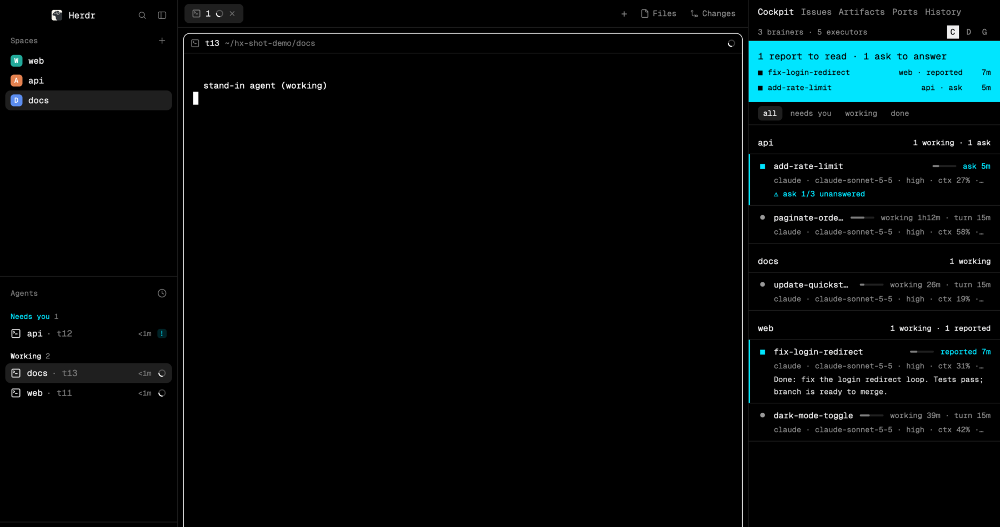

# foreman

**Plan with one agent. Build with many. Keep your repository out of the planner's hands.**

[](https://github.com/GenaroSalomone/foreman/actions/workflows/ci.yml)
[](LICENSE)


foreman runs coding agents in two roles, on top of [herdr](https://herdr.dev),
and since 0.8.0 it runs from the herdr desktop app ([The herdr app](#the-herdr-app)):

- a **brainer**, the planner, that reads your code, plans the work and writes
  briefs, but cannot touch your repository;
- **executors** that each take one brief, work in a git worktree of their own
  and report back when they are done.

You talk to the brainer. It sends out the work, and the results come back to it.

**Install on macOS:** `brew install GenaroSalomone/tap/foreman && foreman-setup init`
builds a brain with a demo lane and ends with a dry-run dispatch. Linux, step by
step and requirements: [Quickstart](#quickstart). Not related to Ruby's `foreman`.

## What a prompt looks like

You type one line to the brainer:

```text
Logging in with a capitalised email returns a 500. Fix it.
```

It writes the brief an executor works from, `~/brain/myapp/briefs/fix-login.md`:

~~~md
---
kind: build
---

## Goal
Logging in as `Ann@Example.com` works like `ann@example.com`.

## Done when
- A test that fails on the old code passes on the new.

## Verification
```
npm test -- login
```

## Limits
- Touch only `src/auth/`.
~~~

## Why

Put several coding agents on one repository and three things go wrong. Each has a
mechanism here:

| What goes wrong | What foreman does |
|---|---|
| The planner starts editing, and changes land that nobody reviewed. | A guard refuses the brainer's writes to your repository. |
| Agents step on each other in a shared checkout. | One worktree and one branch per task. |
| Results get lost in a pane nobody is watching. | A report lands in the brainer's session by itself. |

## Concepts

| Term | Meaning |
|---|---|
| **Brain** | The directory the installer creates (`~/brain` here). It holds foreman's commands, its configuration and one folder per lane, outside every repository. |
| **Lane** | One of your repositories, together with the brainer that plans for it. |
| **Brainer** | A long-lived Claude Code session for a lane, opened with `brain <lane>`. A guard refuses its writes to the repository. |
| **Executor** | A disposable agent session, launched with `hw`. It works in its own worktree and branch and ends each task with a report. |
| **Brief** | The executor's instructions, as a Markdown file: goal, scope and the command that proves the work is done. |

## Features

- **A planner that cannot write.** The installer never writes inside your
  repositories and never reads a credential.
- **One worktree and one branch per task**, outside your checkout, with its own
  database where the lane provisions one.
- **Reports that arrive.** `done-invoker` puts the executor's report in the
  brainer's session, with no polling; `ask-invoker` asks it a question and waits.
- **Briefs that are checked.** A brief's front matter is validated against the
  dispatch before anything is built, and `hw done` runs the brief's verification
  command itself and records its exit code.
- **Your agent, your model.** Claude Code and pi are the native agents;
  OpenCode and Codex also run a lane's executors, deprecated and with limits ([L3](docs/KNOWN-LIMITATIONS.md),
  [L3b](docs/KNOWN-LIMITATIONS.md)). Each executor gets a `cheap-explorer` subagent on its vendor's cheapest tier.
- **A review you did not have to ask for.** A build gets a fresh reviewer after its report, and `hw done` offers the merge only for an approved head; `review: [judgment-day, thermo]` adds pieces to it.
- **Frameworks when you want them.** By default the brief is the whole
  contract; `--sdd speckit` opts into [Spec Kit](https://github.com/github/spec-kit)'s phases.
- **Secrets as Bitwarden items.** A brief names `secrets: [item, …]`; the value
  reaches the executor through `hw secret run`, never as text in a brief or a prompt.
- **A cockpit.** A card per executor, in the herdr app's side panel or as a band
  above the brainer's prompt in the terminal UI, naming the one that needs you.
- **Cleanup that is safe.** `hw reap` removes the worktree, branch and database of a task that is merged and clean, and nothing else.
- **A Go core.** `hw`, `brain`, `channel-send` and the invokers run in `hw-core`, which the installer builds ([INSTALL.md](docs/INSTALL.md#the-go-core-and-the-way-back), [L16](docs/KNOWN-LIMITATIONS.md)).

## What 1.0 promises

From 1.0.0 a change that breaks a working setup takes a new major version. That
covers `hw`, `brain`, the invokers, the brief format, the install and the herdr
app: foreman's mods and layouts for it, and the `hc` backend it runs on. Codex
and OpenCode are deprecated and outside the promise: they keep working, and
either can be removed without a major version
([REFERENCE.md](docs/REFERENCE.md#what-10-promises)).

## Requirements

- **macOS or Linux** (Debian/Ubuntu-class, bash 5 for the shell parts); Linux works, not verified per release
  ([L1](docs/KNOWN-LIMITATIONS.md)).
- **[herdr](https://herdr.dev)**, running, with its Claude Code integration:
  `herdr integration install claude`. The desktop app is optional: the terminal
  UI works without it ([The herdr app](#the-herdr-app)).
- **[Claude Code](https://claude.com/claude-code)**, with its first run finished:
  run `claude --dangerously-skip-permissions`, complete the welcome and login,
  accept the warning, then `/exit`. `install.sh --permissions ask` leaves the
  permission prompts on ([INSTALL.md](docs/INSTALL.md#permissions-skip-recommended-or-ask)).
- `git` with `user.name` and `user.email` set (a dispatch commits as you; an unset identity can fail it),
  `jq` 1.7 or newer, `python3`, `rg`, `fd` and `sd`; on Linux, Node 22.7 or newer.
- **Go 1.22 or newer**, which `install.sh` uses to build `hw-core`. `install.sh --check`
  lists it as missing and names https://go.dev/dl.

On macOS, Homebrew installs all of these but Claude Code's first run. Each tool
has a minimum version, kept in `lib/hw/deps.conf`; `install.sh --check` and
`hw preflight` name the command that updates one
([INSTALL.md](docs/INSTALL.md), [L15](docs/KNOWN-LIMITATIONS.md)). engram, pi, Bitwarden
and the rest are optional: [Tools foreman works with](#tools-foreman-works-with).

## Quickstart

### 1. Homebrew, on macOS

Every `brew` command below needs [Homebrew](https://brew.sh) (skip this if
`brew --version` already answers). Its installer also installs Apple's Command
Line Tools:

```sh
/bin/bash -c "$(curl -fsSL https://raw.githubusercontent.com/Homebrew/install/HEAD/install.sh)"   # brew.sh's own installer; it also installs the Command Line Tools
```

It ends by printing two `eval "$(…/brew shellenv)"` lines: add them to your shell
profile and open a new terminal.

### 2. Install

On macOS, one command builds a brain, a `demo` lane over a toy repository and a
sample brief, and ends with a dry-run dispatch:

```sh
brew install GenaroSalomone/tap/foreman
foreman-setup init             # checks what you have, builds ~/brain with a demo lane, ends with a dry-run dispatch
foreman-setup init --dry-run   # the plan only; --yes answers its questions
```

`init` names each missing tool with its install command and offers to install
what Homebrew carries. A second run changes nothing and says so
([INSTALL.md](docs/INSTALL.md#quick-start-foreman-setup-init)). For your own
repository instead of the demo, `foreman-setup` takes the installer's flags
(`foreman-setup --with-recommended` installs Claude Code, engram and fzf):

```sh
foreman-setup --brain ~/brain --lane myapp --repo ~/code/myapp   # creates your brain and a first lane
export PATH="$HOME/.local/bin:$PATH"                          # puts hw and brain on your PATH
brain myapp                                                   # opens the brainer
```

On Linux, or without Homebrew, the installer runs from a pipe:

```sh
curl -fsSL https://raw.githubusercontent.com/GenaroSalomone/foreman/main/install.sh | bash -s -- --brain ~/brain --check   # checks everything, writes nothing
curl -fsSL https://raw.githubusercontent.com/GenaroSalomone/foreman/main/install.sh | bash -s -- --brain ~/brain --lane myapp --repo ~/code/myapp   # creates your brain and a first lane
```

To read the installer first, clone the repository and run it from there:

```sh
git clone https://github.com/GenaroSalomone/foreman && cd foreman
./install.sh --brain ~/brain --check
./install.sh --brain ~/brain --lane myapp --repo ~/code/myapp
```

Add the `PATH` line to your shell profile so it survives a new terminal.
`--check` lists what is left, in order, and ends with the next command to run;
this is the head of a healthy one:

```text
$ ./install.sh --brain ~/brain --check
prerequisites
  ok    git
  ok    jq
  ok    jq 1.7.1 (>= 1.7)
  ok    python3
  ok    herdr
  ok    claude
  ok    herdr 0.9.5 (>= 0.9.1)
  ok    claude 2.1.322 (>= 2.1.289)
  ok    go 1.27 (builds hw-core)
  …

first run of Claude Code in this account (yours to do)
  ok    welcome completed
  ok    logged in
  ok    Bypass Permissions warning accepted
```

### 3. Try it on a toy repository

Before the first `brain`, finish the [Requirements](#requirements); `--check` names what is left.

```sh
git init ~/code/toy && echo "toy: a throwaway repository for trying foreman." > ~/code/toy/README.md
git -C ~/code/toy add README.md && git -C ~/code/toy commit -m init
./install.sh --brain ~/brain --lane demo --repo ~/code/toy
cp docs/examples/demo/briefs/hello.md ~/brain/demo/briefs/
herdr   # once, in a terminal: `brain` needs herdr's server (without it: server_not_running)
brain demo
```

Then, in the brainer (type it with Claude Code's `!` prefix, or ask the brainer
to do it):

```sh
hw demo hello --brief ~/brain/demo/briefs/hello.md --sdd none --no-report --dry-run   # shows the plan, creates nothing
hw demo hello --brief ~/brain/demo/briefs/hello.md --sdd none             # launches it
```

In a dry run, `!` lines are warnings and `✗` stops it: `herdr's agent registry could not be read` means herdr is
not running, and Claude Code's first run pending means finish it as `--check` says.
`--no-report` is for the preview only, outside a pane `brain` opened
([L7](docs/KNOWN-LIMITATIONS.md)); the launch line has none. An executor opens in a
new herdr tab, writes `HELLO.md`, commits it on branch `task/hello`, and its
report arrives in the brainer's session.

### Upgrading

```sh
foreman-setup upgrade --brain ~/brain              # the newest release, with the flags you installed with
foreman-setup upgrade --brain ~/brain --dry-run    # says what it would do and changes nothing; --to 0.3.0 goes back
```

`upgrade` replays the flags the install recorded, runs `--check` and prints the
new release's "In short"; `hw status` tells you when a newer release exists
([INSTALL.md](docs/INSTALL.md#the-command)).

## How it works

1. **Brief.** You describe the work; the brainer writes a brief
   ([what that looks like](#what-a-prompt-looks-like)).
2. **Dispatch.** `hw` creates a worktree and branch outside your checkout,
   opens a herdr tab, starts the agent and makes sure the brief arrived.
3. **Work.** The executor works and commits on its branch. If it needs a
   decision, it asks the brainer with `ask-invoker` and waits for the answer.
4. **Report.** The executor finishes with `done-invoker`. The report arrives
   in the brainer as a message, with no polling.
5. **Close.** `hw done` runs the brief's verification, records the result and
   closes the tab. Merging is always up to you; once it is merged, `hw reap`
   removes the task's worktree, branch and database.

## Everyday use

| Command | What it does |
|---|---|
| `brain <lane>` | Open the lane's brainer. |
| `hw <lane> <task> --brief <path> --sdd none` | Launch an executor. Add `--dry-run` to preview. |
| `hw` | A picker over every lane's briefs, plus a `+ new brief` row (needs [fzf](https://github.com/junegunn/fzf)). |
| `hw status` | What is running, what reported and what is left over. |
| `hw ledger [<lane>]` | Every brief as never-dispatched, in-progress or done. |
| `hw ruling <pane> "<correction>"` | Correct an executor that is still working, or resume one that reported `--blocked`. |
| `hw next <pane> --brief <path>` | Give the next task to an executor launched with `--keep-pane`. |
| `hw done <lane> <task>` | Run the brief's verification and close the task's tab. |
| `hw reap [<lane>]` | List merged worktrees and task branches that are safe to remove; `--apply` removes them. |
| `hw train add\|push <lane> …` | Merge reported tasks into `train-<lane>`, then run the suite and move `main` to it. |

A brief's front matter also takes `review:`, `secrets:` and `plugins:` ([tools](#tools-foreman-works-with)). `hw help all` lists every
command and flag, `hw help <topic>` shows one part, and [REFERENCE.md](docs/REFERENCE.md) has
each row in full, with the frameworks, the cockpit and every lane setting. `<pane>` is the executor's herdr pane, as
`hw status` lists it.

### Secrets (Bitwarden)

A credential an executor needs is a Bitwarden item in the folder `agents`, named
in the brief's `secrets: [item, …]`. `hw` checks the vault and each item before
it builds anything, and the executor reaches the value only through
`hw secret run <item> --as VAR -- <cmd>`: it lands in `<cmd>`'s environment and
is not printed or written ([INSTALL.md](docs/INSTALL.md#secrets-bitwarden),
[L23](docs/KNOWN-LIMITATIONS.md)).

### The herdr app

0.8.0 runs foreman from the [herdr desktop app](https://herdr.dev). In a terminal
the app opened, `brain <lane>` opens the lane's brainer there and `hw` launches
its executors in app terminals of their own, `--sandbox` included; a report, an ask, a ruling,
`hw next`, `hw done` and `hw revive` go through the same commands as in the
terminal UI. A report sent while the brainer is closed arrives when it reopens.



The right column holds the Cockpit, Issues and Artifacts panels. The look in the
picture is foreman's own; this export carries the Cockpit mod only
([`herdr-app/`](herdr-app/README.md) says how to put it in a layout). Without the
app, `brain <lane>` opens the brainer in a herdr pane, as in the rest of this
page. What the app route does not do, each refused with its reason — `--here`,
`brain --in-pane`, `hw revive` of an agent other than Claude, `hw unstick`
restarting a stuck OpenCode — and what it does differently (a sandboxed executor
publishes no turn-end label) is in
[L29](docs/KNOWN-LIMITATIONS.md#l29-the-herdr-app-herdr-core-carries-turn-end-tokens-the-brainer-and-the-executor-launch).

### The cockpit

A card per executor, with what waits on you first: in the herdr app's right
panel, or in the terminal UI as a band above the brainer's prompt (`/cockpit`
opens the full pane). A card shows the task, its state and how long it has held
it, the model and its context use, the commits, and a warning when something
needs you: an ask, a blocked report, no progress. Turn it off with
`FOREMAN_COCKPIT=0` or `brain <lane> --no-cockpit`; every card line is in
[REFERENCE.md](docs/REFERENCE.md#the-cockpit).

### Customize a lane

`projects.json` at the brain root is the one place a lane's settings live, and
`brief_note` there adds a rule to every executor prompt of that lane. Every field is
in [REFERENCE.md](docs/REFERENCE.md#customizing-a-lane-projectsjson).

## Tools foreman works with

Each has code here that installs, pins, launches or reads it. A version is a floor from `lib/hw/deps.conf`; a sha is a pinned commit.

| Tool | What foreman does with it | Needed | Version |
|---|---|---|---|
| [herdr](https://herdr.dev) | Opens every brainer and executor in its tabs or app terminals, and delivers reports through it. | required | 0.9.1 or newer |
| [Claude Code](https://claude.com/claude-code) | Runs the brainer, and a lane's executors by default. | required | 2.1.289 or newer |
| [pi](https://github.com/earendil-works/pi) | Runs executors with `--agent pi`, through foreman's own extension ([L3b](docs/KNOWN-LIMITATIONS.md)). | optional | |
| [Go](https://go.dev/dl) | `install.sh` builds `hw-core` with it. | required | 1.22 or newer |
| [jq](https://jqlang.github.io/jq/) | Reads `projects.json` and herdr's answers, with `git`, `python3`, `rg`, `fd` and `sd`. | required | 1.7 or newer |
| [engram](https://github.com/Gentleman-Programming/engram) | The brainer's memory across sessions and the store an executor's findings go to ([L8](docs/KNOWN-LIMITATIONS.md)). | recommended | 3.0.0 or newer |
| [Bitwarden CLI](https://bitwarden.com/help/cli/) | `hw secret run` hands a brief's `secrets:` to one command's environment ([L23](docs/KNOWN-LIMITATIONS.md)). | optional | |
| [fzf](https://github.com/junegunn/fzf) | Draws the brief picker a bare `hw` opens. | optional | |
| [agent-browser](https://github.com/vercel-labs/agent-browser) | Each run gets its own browser namespace and profile, and `browser-close` proves the close. | optional | |
| [GitHub CLI](https://cli.github.com) and [gh-image](https://github.com/drogers0/gh-image) | `gh-attach` puts screenshots on a pull request or an issue; gh-image is built from a pinned commit. | optional | v1.4.1, `ca57d96` |
| [Spec Kit](https://github.com/github/spec-kit) | `--sdd speckit` runs its phases where its skills are installed ([L14](docs/KNOWN-LIMITATIONS.md)). | optional | |
| Judgment Day | The bundled blind review by two judges: `install.sh --with-judgment-day`, then `review: judgment-day` ([L10](docs/KNOWN-LIMITATIONS.md)). | optional | bundled |
| [thermo](https://github.com/cursor/plugins) | Review piece: a strict maintainability rubric. | optional | `1e5c90a` |
| [ponytail](https://github.com/DietrichGebert/ponytail) | Review piece: lean-code skills, with hooks and a pi extension. | optional | `2961b52` |
| [pstack](https://github.com/michael-denyer/pstack-claude) | Review piece: skills, agents and hooks, with a pi extension. | optional | `94f5ce9` |
| `tests` | foreman's own review piece for the tests a change ships; its rubric is from [superpowers](https://github.com/obra/superpowers). | optional | `22f0b46` |
| [webguide](https://github.com/GoogleChrome/modern-web-guidance) | Chrome's Modern Web Guidance, loaded with `plugins: [webguide]` on a brief that touches UI. | optional | `4dd9683` |
| [OpenCode](https://opencode.ai) and [Codex](https://github.com/openai/codex) | Also run executors; both are deprecated ([L3](docs/KNOWN-LIMITATIONS.md), [L4](docs/KNOWN-LIMITATIONS.md)). | optional | OpenCode 1.18.31 |

The five plugins load into one executor, from pinned copies a brain vendors ([L22](docs/KNOWN-LIMITATIONS.md)); `hw preflight` names a tool below its floor.

## How it compares

| | Isolation | Guards the brainer | Agents | UI |
|---|---|---|---|---|
| **foreman** | worktree and branch per task | yes | Claude Code and pi; OpenCode and Codex, deprecated ([L3](docs/KNOWN-LIMITATIONS.md)) | herdr desktop app or panes |
| [claude-squad](https://github.com/smtg-ai/claude-squad) | tmux and worktree per agent | — | Claude Code, Codex, Gemini, Aider | TUI |
| [Conductor](https://www.conductor.build) | isolated workspaces | — | Claude Code, Codex, Cursor | macOS app |
| [uzi](https://github.com/devflowinc/uzi) | worktree per agent | — | Claude Code, Codex and others | CLI and tmux |
| [container-use](https://github.com/dagger/container-use) | container per agent | — | any agent through MCP | terminal and web |
| [vibe-kanban](https://github.com/BloopAI/vibe-kanban) | branch per task | — | Claude Code, Codex, Gemini and others | web kanban |
| [Claude Code agent teams](https://code.claude.com/docs/en/agent-teams) | shared checkout | plan approval | Claude Code | panel or tmux |

Compared from each project's own documentation, September 2026.

## Learn more

- [`INSTALL.md`](docs/INSTALL.md): every install option, OpenCode and engram.
- [`REFERENCE.md`](docs/REFERENCE.md): every command, brief field, cockpit control and lane setting.
- [`BRIEF-TEMPLATE.md`](docs/BRIEF-TEMPLATE.md): what a brief can contain.
- [`THREAT-MODEL.md`](docs/THREAT-MODEL.md): what the guards stop, what they do not
  stop and the opt-in macOS `--sandbox`.
- [`KNOWN-LIMITATIONS.md`](docs/KNOWN-LIMITATIONS.md): what this release does not
  do, or does only partly.
- [`CHANGELOG.md`](CHANGELOG.md): what changed in each release.
- [`CONTRIBUTING.md`](CONTRIBUTING.md) and [`SECURITY.md`](SECURITY.md).

## License

MIT. See [`LICENSE`](LICENSE).
